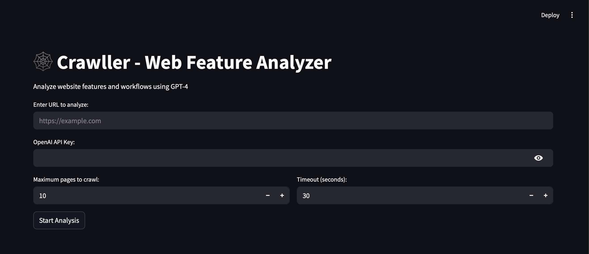
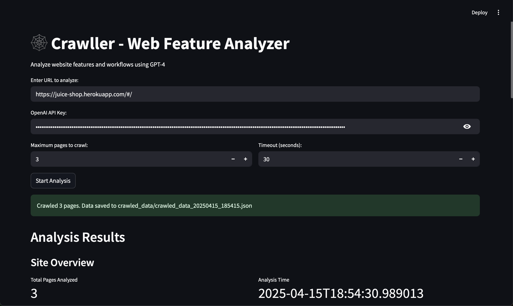
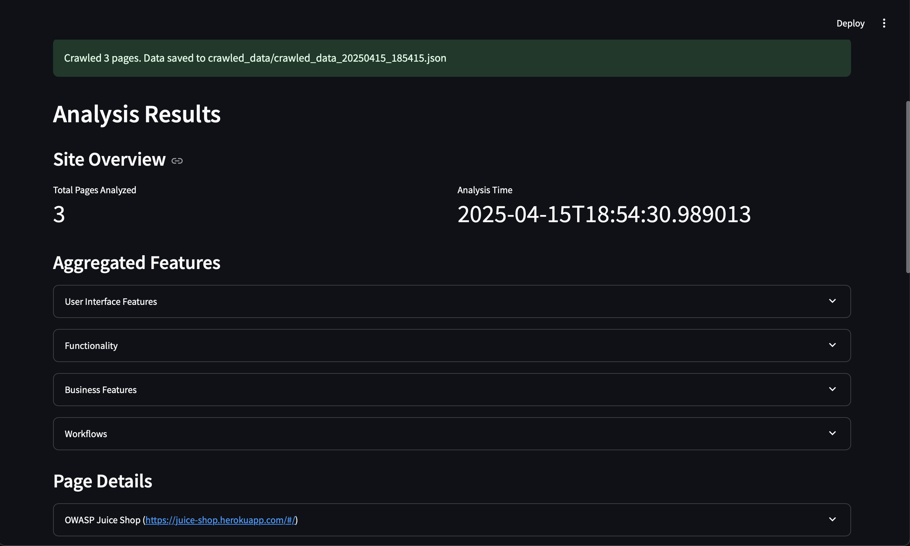

# 🕸️ Crawller - Web Feature Analyzer

🔍 **Crawller** is a Python-based tool that crawls websites, extracts features, and analyzes workflows using GPT-4o-mini. It provides insights into website functionality, user interface features, business features, and workflows through an interactive Streamlit interface.

---

## ✨ Features

- 🔗 **Website Crawling**: Crawl websites to extract data and links.
- 🤖 **Feature Analysis**: Analyze crawled pages using GPT-4 to identify UI features, workflows, and business functionalities.
- 🌐 **Streamlit Interface**: User-friendly web interface for input and result visualization.
- ⚙️ **Customizable Options**: Configure crawling depth, timeout, and maximum pages to crawl.
- 🕒 **Result History**: View previous analysis results directly in the interface.
- 📁 **Data Export**: Save crawled data as JSON files in a dedicated `crawled_data` folder.

---

## 🛠️ Installation

### ✅ Prerequisites

- Python 3.9 or higher  
- [Node.js](https://nodejs.org/) (required for Playwright)  
- [Playwright](https://playwright.dev/) (for browser automation)  

---

### 📦 Steps

1. **Clone the repository:**

    ```bash
    git clone https://github.com/VarunMotiyani/crawller.git
    cd crawller-main
    ```

2. **Create and activate a conda environment:**

    ```bash
    conda create -n crawller-env python=3.9 -y
    conda activate crawller-env
    ```

3. **Install Python dependencies:**

    ```bash
    pip install -r requirements.txt
    ```

4. **Install Playwright browsers:**

    ```bash
    playwright install
    ```

5. **Set up your OpenAI API key:**

    - You can enter the API key directly in the Streamlit app when prompted, or use `.env` or Streamlit Secrets.

---

## 🚀 Usage

### 🏃 Running the Application

1. Start the Streamlit app:

    ```bash
    streamlit run src/app.py
    ```

2. Open the app in your browser (usually at [http://localhost:8501](http://localhost:8501)).

3. Enter the URL to analyze, your OpenAI API key, and configure crawling options.

4. Click **Start Analysis** to begin crawling and analyzing the website.

---

## 📁 Project Structure

```
crawller-main/
├── src/
|   ├── config/
|   |   ├──settings.py        # Configuration settings
│   ├── app.py                # Main Streamlit application
│   ├── crawler.py            # Web crawler implementation
│   ├── feature_extractor.py  # GPT-4-based feature extraction
│   ├── utils/
│   │   ├── helpers.py        # Utility functions
│   └── crawled_data/         # Directory for saving crawled data
├── requirements.txt          # Python dependencies
├── README.md        

```

---
## ⚙️ Configuration

### 🕷️ Crawling Options
You can configure the following options directly in the **Streamlit app**:

- **Maximum Pages to Crawl**:  
  Limit the number of pages the crawler visits.  
  _Default_: `10`

- **Timeout**:  
  Set the timeout (in seconds) for page loading to avoid delays.  
  _Default_: `30`

---

### 💾 Crawled Data
- Crawled data is automatically saved in the `crawled_data/` folder.
- Each file is saved in **JSON** format with a timestamp-based filename for easy identification.

**Example filename**:
```
crawled_data_20250415_123456.json
```

---

## 🧪 Example: Crawling and Analyzing a Website

1. **Enter the URL** in the Streamlit app (e.g., `https://www.wikipedia.org`).
2. **Configure Crawling Options**:
   - **Maximum Pages**: `10`
   - **Timeout**: `30 seconds`
3. Click **Start Analysis**.

Once complete, the app will display analysis results including:

- ✅ **Total Pages Analyzed**
- 🎯 **UI Features** (e.g., buttons, modals, input fields)
- 🔁 **Workflows** (e.g., sign-up flows, search functionality)
- 💼 **Business Features** (e.g., checkout, login, user dashboard)


---

## 🛠️ Troubleshooting

### Common Issues

- **Playwright Not Installed**  
  ➤ Run the following command to install the required browsers:  
  ```bash
  playwright install

- ### 🔐 OpenAI API Key Missing
Ensure you provide a valid OpenAI API key in the Streamlit app when prompted. Without it, the feature extraction via GPT-4 will not function.

- ### 🌐 Crawling Stops After One Page
Check the `extract_links` method in `crawler.py` to make sure it is correctly identifying and returning internal links for further crawling.

- ### 💾 Crawled Data Not Saved
Ensure the `crawled_data/` folder exists. The application should create it automatically if missing, but verify that there are no permission or path-related issues.

---
## Contributing

Contributions are welcome! Please follow these steps:

1. **Fork the repository**:
   - Go to the repository's GitHub page and click on the "Fork" button at the top-right of the page.

2. **Create a new branch**:
   - After forking the repository, clone it to your local machine:
     ```bash
     git clone https://github.com/VarunMotiyani/crawller.git
     cd crawller-main
     ```
   - Create a new branch for your feature or bug fix:
     ```bash
     git checkout -b my-new-feature
     ```

3. **Commit your changes**:
   - Make the necessary changes to the codebase.
   - Add the modified files to staging:
     ```bash
     git add .
     ```
   - Commit your changes with a meaningful message:
     ```bash
     git commit -m "Add new feature or fix bug"
     ```

4. **Push to your branch**:
   - Push your changes to the new branch on your fork:
     ```bash
     git push origin my-new-feature
     ```

5. **Open a pull request**:
   - Go to the original repository on GitHub, and you'll see a prompt to open a pull request with the changes from your fork.
   - Click on "New Pull Request", provide a description of your changes, and submit it for review.

Thank you for contributing!

---

## 📸 Screenshots

### 🔘 Streamlit Home Interface


---

### 🕷️ Crawling Results Preview


---

### 🧠 Feature Analysis Report



